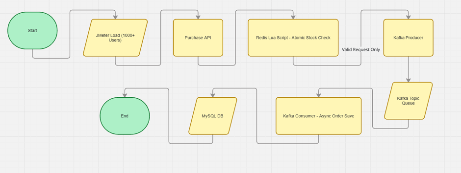
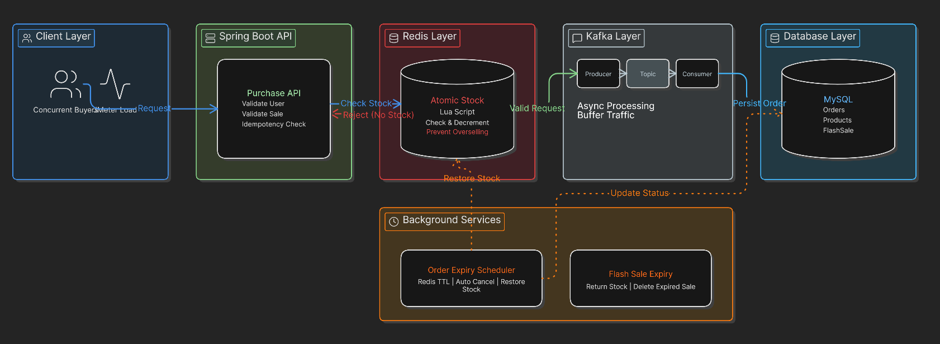
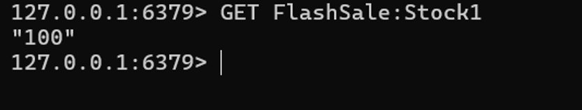
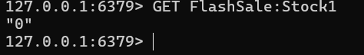
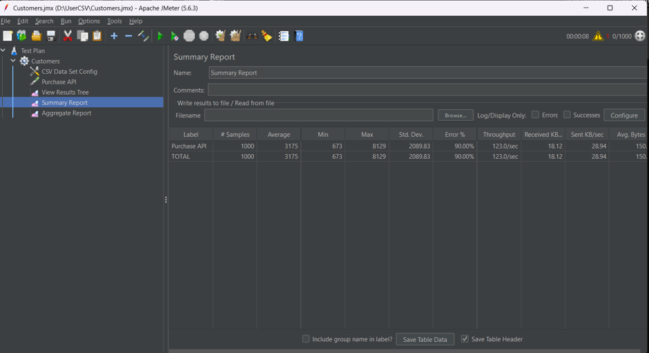

# FlashCart

A High-Concurrency Flash Sale Backend System built using Spring Boot, Redis, Kafka, MySQL, Docker, and JMeter.

FlashCart simulates how large-scale e-commerce platforms such as Amazon, Flipkart, and Myntra handle flash sales where thousands of users attempt to purchase limited-stock products simultaneously.

The project focuses on solving real-world distributed system challenges including overselling prevention, duplicate order protection, traffic spikes, asynchronous processing, stock consistency, and order expiry management.

---

## Project Highlights

- High-Concurrency Flash Sale Processing
- Redis-based Atomic Stock Management
- Kafka-based Asynchronous Order Processing
- Idempotency Protection
- Order Expiry Handling using Redis TTL
- Flash Sale Expiry Management
- MySQL Persistent Storage
- Dockerized Infrastructure
- JMeter Load Testing
- Zero Overselling Under Concurrent Load

---

## Problem Statement

Traditional applications struggle during flash sales because thousands of users attempt to purchase the same product simultaneously.

This creates multiple challenges:

- Overselling inventory
- Duplicate orders
- Database bottlenecks
- Race conditions
- Stock inconsistency
- Application crashes during traffic spikes

FlashCart was designed to solve these problems using industry-standard distributed system concepts.

---

## Technology Stack

| Technology | Purpose |
|------------|----------|
| Java 21 | Core Programming Language |
| Spring Boot | Backend Framework |
| Spring Data JPA | ORM Layer |
| MySQL | Persistent Database |
| Redis | In-Memory Data Store |
| Apache Kafka | Event Streaming & Queueing |
| Docker | Infrastructure Containerization |
| Apache JMeter | Load Testing |
| ModelMapper | DTO Mapping |
| Maven | Dependency Management |

---

## System Architecture

The architecture follows an event-driven approach where Redis handles stock management and Kafka handles asynchronous order processing.

### System Architecture Diagram



---

## Complete Purchase Flow

### Step 1 – User Initiates Purchase

User sends request:

```http
POST /api/order/flashSale/{saleId}/user/{userId}?quantity=1
```

---

### Step 2 – Redis Stock Validation

The application checks available stock directly from Redis.

Redis performs:

- Atomic stock validation
- Atomic stock decrement

using Lua Script.

This ensures:

- No race conditions
- No negative stock
- No overselling

---

### Step 3 – Kafka Producer

If stock is available:

- Request is not immediately stored in MySQL.
- Request is published to Kafka Topic.

Benefits:

- Prevents database overload
- Handles traffic spikes
- Improves response time

---

### Step 4 – Kafka Consumer

Kafka Consumer continuously listens for incoming purchase events.

Consumer:

- Retrieves event
- Creates order
- Stores order in MySQL

---

### Step 5 – Order Expiry

Orders are initially created as:

```text
CREATED
PENDING PAYMENT
```

Redis TTL is assigned to each order.

If payment is not completed within the specified time:

- Order is cancelled
- Stock is restored
- Redis key is removed

---

### Step 6 – Flash Sale Expiry

When sale duration ends:

- Remaining flash sale stock is returned to Product Inventory
- Redis stock cache is removed
- Sale record is cleaned up

---

## Core Features

### Product Management

- Create Product
- Update Product
- Delete Product
- View Product
- Inventory Management

---

### Flash Sale Management

- Create Flash Sale
- Update Flash Sale
- Delete Flash Sale
- View Active Flash Sales
- Sale Expiry Handling

---

### High-Concurrency Order Processing

- Supports thousands of concurrent requests
- Atomic stock validation
- Kafka event processing
- Async order creation

---

### Redis Integration

Redis is used as the primary stock manager.

Features:

- Stock caching
- Lua Script based atomic decrement
- Order expiry TTL
- Ultra-fast reads and writes

---

### Kafka Integration

Kafka acts as a traffic buffer between API and Database.

Benefits:

- Traffic smoothing
- Event-driven architecture
- Async processing
- Database protection

---

### Idempotency Protection

Prevents duplicate orders from same user.

Implementation:

```text
saleId + userId
```

Example:

```text
1_25
```

A user can purchase only once in the same flash sale.

---

### Order Expiry Management

Orders remaining unpaid are automatically cancelled.

Benefits:

- Stock is never blocked permanently
- Inventory remains accurate
- Real-world reservation behavior

---

## Engineering Challenges Solved

### 1. Overselling Prevention

#### Problem

Under heavy concurrency, multiple requests could purchase the same stock simultaneously.

#### Solution

Redis Lua Script

Performs:

- Stock validation
- Stock decrement

in a single atomic operation.

#### Result

- No negative stock
- No overselling
- Guaranteed stock consistency

---

### 2. Database Overload Prevention

#### Problem

Database cannot handle thousands of concurrent writes efficiently.

#### Solution

Kafka introduced between API Layer and Database.

Flow:

```text
API
 ↓
Kafka Producer
 ↓
Kafka Topic
 ↓
Kafka Consumer
 ↓
MySQL
```

#### Result

- Stable database
- Smooth traffic handling
- Scalable architecture

---

### 3. Duplicate Order Prevention

#### Problem

User refreshes page or retries request.

#### Solution

Idempotency Key

```text
saleId_userId
```

#### Result

- No duplicate purchases
- Safe retries

---

### 4. Order Expiry Handling

#### Problem

Unpaid orders block inventory forever.

#### Solution

Redis TTL + Scheduler

#### Result

- Automatic cancellation
- Inventory recovery

---

## API Documentation

### Product APIs

| Method | Endpoint |
|----------|-----------|
| POST | /api/products |
| GET | /api/products |
| GET | /api/products/{id} |
| PUT | /api/products |
| DELETE | /api/products/{id} |

---

### Flash Sale APIs

| Method | Endpoint |
|----------|-----------|
| POST | /api/flashSale |
| GET | /api/flashSale |
| GET | /api/flashSale/{id} |
| GET | /api/flashSale/active |
| PUT | /api/flashSale |
| DELETE | /api/flashSale/{id} |

---

### Order APIs

#### Purchase Product

```http
POST /api/order/flashSale/{saleId}/user/{userId}?quantity=1
```

---

#### Complete Payment

```http
POST /api/order/{orderId}/pay?paymentSuccess=true
```

---

## Load Testing

Load testing was performed using Apache JMeter.

### Test Configuration

| Metric | Value |
|----------|---------|
| Concurrent Users | 1000 |
| Flash Sale Stock | 100 |
| Ramp-Up Time | 5 Seconds |
| Loop Count | 1 |

---

### Test Results

| Metric | Result |
|----------|---------|
| Concurrent Users | 1000 |
| Flash Sale Stock | 100 |
| Orders Created | 100 |
| Overselling | 0 |
| Failed Requests | 900 |
| Redis Stock Remaining | 0 |

Result:

Only 100 orders were created for 100 available stock.

This proves:

- Stock consistency
- Correct concurrency handling
- No overselling

---

## Project Architecture



---

## Redis Stock Management

### Before Load Test

Redis stock initialized.



### After Load Test

Redis stock reduced to zero.



This confirms:

- Atomic stock decrement
- Accurate inventory tracking
- No overselling

---

## Load Testing Results

### JMeter Summary Report



This demonstrates:

- Successful handling of concurrent traffic
- Stable application behavior
- Correct order creation logic

---

## Database Verification

### Orders Created After Load Test

The database contains exactly 100 orders after processing 1000 concurrent requests against 100 available stock.

This confirms:

- No overselling
- Correct Kafka processing
- Accurate stock validation

---

## Project Structure

```text
src/main/java/com/FlashCart/FlashSaleSystem

├── Config
├── Controller
├── DTOs
├── Models
├── Repository
├── Service
├── Enums
└── ErrorControl
```

---

## Docker Setup

### Redis

```bash
docker run --name redis -p 6379:6379 redis
```

---

### Kafka

```bash
docker compose up -d
```

---

## Local Setup

### Clone Repository

```bash
git clone https://github.com/YOUR_USERNAME/FlashCart.git
```

---

### Create Database

```sql
CREATE DATABASE flashcart_app;
```

---

### Configure Application Properties

```properties
spring.datasource.url=jdbc:mysql://localhost:3306/flashcart_app
spring.datasource.username=YOUR_USERNAME
spring.datasource.password=YOUR_PASSWORD

spring.redis.host=localhost
spring.redis.port=6379

spring.kafka.bootstrap-servers=localhost:9092
```

---

### Run Application

```bash
./mvnw spring-boot:run
```

---

## Future Enhancements

- JWT Authentication
- Role-Based Access Control
- Prometheus Monitoring
- Grafana Dashboards
- Kubernetes Deployment
- Redis Cluster
- Kafka Partition Scaling
- Payment Gateway Integration
- Multi-Region Deployment

---

## Key Learnings

Through this project, I gained hands-on experience with:

- Spring Boot Backend Development
- Distributed System Design
- Redis Atomic Operations
- Kafka Event Streaming
- Concurrency Handling
- Load Testing with JMeter
- Docker Containerization
- Database Optimization
- Event-Driven Architecture

---

## Author

Om Pawar

Information Technology Engineering Student

Focused on:

- Backend Engineering
- Distributed Systems
- Spring Boot
- Redis
- Kafka

GitHub: https://github.com/omdpawar214
